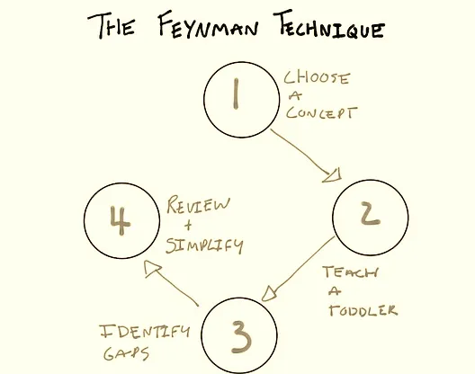

# Learning Process

<strong>Figure:</strong> Richard P. Feynman

## 1. How to Learn Faster with the Feynman Technique

### 1.1 Feynman Technique
The Feynman Technique is a learning method named after Richard Feynman. In this technique, a person explains the concept they are learning to themselves in a simple way to find gaps in their knowledge.

---
### 1.2 Ways To Implement Feynman Technique
### 1st Step
- *Choose a subject*
- *Write down everything you know about the subject. Divide into several parts.*

The first step of the Feynman Technique is to write your chosen topic at the top of a page. Then write down everything you know about it, and add it whenever you learn something new. The best way to take this first step is to write in simple terms. Think that you are explaining the subject to a child, that is, use basic vocabulary and make connections that are simple to understand.

Jargon and complicated terms can mask your level of learning – even to yourself. By writing the idea in clear language, you "force" yourself to understand enough to be able to simplify the relationships. It's okay if this seems difficult. Try to identify the points where you fail to understand, this enriches learning.

### 2nd Step
- *Teach the concepts to someone else.*
- *Teach – or pretend to teach – a child*

Here the idea is really to teach – it doesn't matter if you have an audience or not. The important thing is to explain the topic in terms that are easy to understand. Thus, you consolidate what you have understood so far and easily visualize what is still unclear.

### 3rd Step
- *Identify the “holes” in your own understanding*
- *As you teach, questions will arise and you will encounter gaps in knowledge. Write down these gaps and study them.*

From your attempt to explain to another person, you will realize the holes in your own learning. Revisit these points and go back to your sources of information until you can fully explain the concept.

### 4th Step
- *Review, organize and simplify*
- *Simplify your knowledge so that anyone can understand what you are saying.*

Revise your work so far while further simplifying the language (make sure you are using your own words and not jargon from the material you have studied). Illustrate with examples and, if necessary, connect concepts and make analogies to strengthen your understanding. The goal is to organize all the content into a simple, flowing story.

Finally, read it aloud, and if it still seems confusing, it could be an indication that your understanding is not yet complete. If so, study again and fill in the "holes" again.

<strong>Figure:</strong> The Feynman Technique

---
## 2. Learning How to Learn TED talk by Barbara Oakley

### 2.1 Video CRUX
- The elephant in the room:
  - How did you change your brain?
- Focus Mode 
- Analogy time:
  - Pinball Machine 
- Examples of 2 great personalities
  - Salvador Dali
  - Thomas Edison (Thomas Edison stole ideas from Nikola Tesla)
- Procrastination 
- Slow thinking 
- Illusions of competence in learning 

A brief description about them and steps to be taken to improve learning process are discussed below.

---
### 2.2 Steps to take to improve learning process.
#### Focused versus Diffuse Thinking
- Metaphors provide powerful techniques for learning
- Focused and diffuse modes (relax, let your mind flow in diffuse mode, then think in focused)
- Learning something difficult takes time

#### Procrastination, Memory, Sleep
- Use Pomodoro technique to avoid procrastination, useful for focusing (agree, it is much easier to focus on something, I’ve started to use this site on a regular basis)
- Practice makes permanent- neurons become linked together through repeated use
- Long term memory & working memory
- Spaced repetition- repeat what you’re trying to retain over a number of days, the chance to remember will be higher
- Sleep:
    - cleans toxic products in your brain
    - erases the less important parts of memories
    - strengthens areas that you need or want to remember
- Learning by doing, by active engagement and not passive listening
> Smart != success; passion + persistence = success

#### Chunking
- focus on something you’re learning
- understand the basic idea (understanding is like a glue to build and connect chunks)
- the first time you actually understand = the first time you can actually do it yourself
- learning = chunks (how to do something) + context (when to/not to use it)

#### Illusions of competence
- Recall is the best learning technique (instead of passive readings)
- Minimize highlights- try to understand the main idea first and then highlight
- Notes and helpful words are great- add them
- Tests yourself= recall
- Interleaving is a great way to master a new subject (jump between different problems/situations, use different techniques/strategies)

#### Focused learning
- Once a week write a brief weekly list of key tasks in a planner journal
- Daily “to do” list- frees working memory for problem-solving
- Make them as small as a pomodoro chunk
- Interleave (just between different topics)
- Planning your quitting time is as important as planning your working time
- Try to work on the most important and most disliked task first

---
---
## 3. Learn Anything in 20 hours

### 3.1 Key Takeaways.
Misconception: How Long does it take to Acquire a New Skill?
We may have heard of the 10,000 hours rule.

Originally, this came from a research by Prof. K. Anders Eriksson on expert-level performance of professional athletes, chess grandmasters, etc.

How long does it take to get to the top of the field? He found that it took 10,000 hours of practice

Malcolm Gladwell wrote the book on Outliers (The Story of Success) in 2007. The centerpiece of the book is the mention of the 10,000 hours rule. A misconception led to the change of meaning of the 10,000 hours rule to go from “it takes 10,000 hours to reach the top of the field” to eventually become “it takes 10,000 hours to learn something”.

Skill Acquisition
Studies on skills acquisition typically times how long a particular participant takes to accomplish a task. With a little bit of practice the time that it takes greatly reduces.

Learning Curve
When you start, you are grossly incompetent. With a little bit of practice you become quite good really quick. At a certain point, you reach a plateau and the subsequent gains takes longer to reach.

For example, it may take you 5 hours to complete a task for the first time. But with a little practice you may find yourself completing the task in a shorter period of time such as 3 hours the second time around, 2 hours the third time, etc.

How long does it take to go from zero to become reasonably good at something?
Hint: It’s not 10,000 hours!

Research from Josh Kaufman indicates that it takes only 20 hours of focused, deliberate practice for you to become reasonably good at something.

---
### 3.2 Steps to take while approaching a new topic
4 Simple Steps to Rapid Skill Acquisition
1. Deconstruct the skill
Decide exactly what you want to be able to do when you’re done. The skill is kind of like a big bundles of skills. The more you can break apart the skills, the more you will be able to figure out which skills will help you to reach your goal.

2. Learn enough to self-correct
Get 3–5 resource about what you want to learn (books, CDs). Don’t use this as a form of procrastination.
Learn just enough so that you can self edit or self correct as you practice.
The learning becomes a way of getting better at noticing when you make a mistake and then doing something a little different.
3. Remove practice barriers
Identify the distractions that are keeping you from practicing (e.g. TV, internet, etc.) and eliminate them.

4. Practice for at least 20 hours
Most skills have the “frustration barrier” (i.e. that grossly incompetent feeling).

Feeling stupid is a barrier to us actually sitting down and doing the work.

By pre-committing to 20 hours of practice, we can overcome this frustration barrier and get through it, in order to reap the rewards.

---
